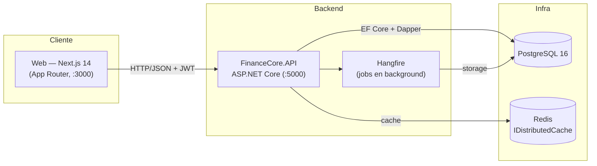
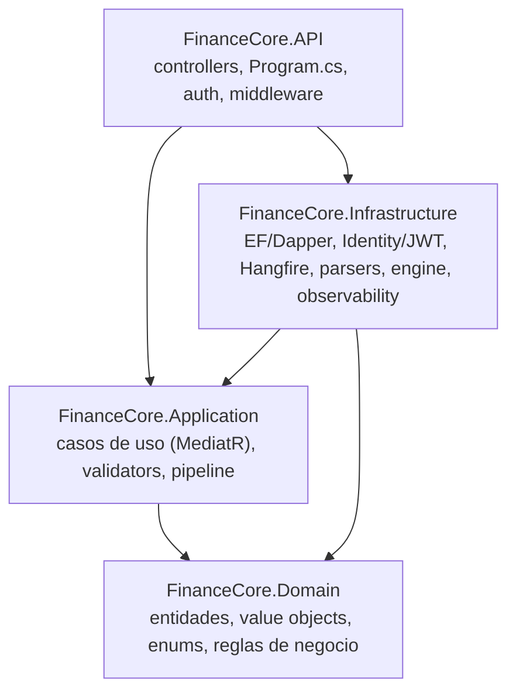

# Arquitectura de FinanceCore

Documento de orientación para quien entra al repo. Describe **cómo está
organizado el sistema, por qué, y cómo fluye una request de punta a punta**.
Para levantar el entorno local ver [`README.md`](README.md) (backend) y
[`web/README.md`](web/README.md) (frontend).

---

## 1. Qué es

FinanceCore es un sistema de **conciliación financiera** multi-cuenta /
multi-moneda. El núcleo del dominio es: ingerir transacciones internas,
compararlas contra extractos bancarios externos (statements) y materializar las
**discrepancias** para que un operador las resuelva y apruebe la conciliación.

---

## 2. Vista de alto nivel



- **Web** habla con la API por HTTP/JSON, autenticando con un **JWT** (access +
  refresh). No accede a la base directamente.
- **API** es el único punto de escritura; orquesta dominio, persistencia, cache
  y jobs.
- **Postgres** es la fuente de verdad; **Redis** es cache (`IDistributedCache`)
  y **Hangfire** corre trabajos diferidos usando Postgres como storage.

---

## 3. Backend — Clean Architecture

Cuatro proyectos (`src/`), con la regla de dependencia apuntando **hacia
adentro**: las capas externas conocen a las internas, nunca al revés.



| Capa | Proyecto | Responsabilidad | No conoce |
|---|---|---|---|
| **Domain** | `FinanceCore.Domain` | Entidades ricas (`Transaction`, `Account`, `Reconciliation`), invariantes, máquina de estados, enums. | Nada externo. |
| **Application** | `FinanceCore.Application` | Casos de uso como commands/queries de MediatR, validators FluentValidation, pipeline de behaviors, interfaces de repositorio. | EF, ASP.NET, HTTP. |
| **Infrastructure** | `FinanceCore.Infrastructure` | Implementaciones: persistencia EF Core + Dapper, Identity/JWT, motor de conciliación, parsers CSV/XLSX, Hangfire, observability. | El detalle de transporte HTTP. |
| **API** | `FinanceCore.API` | Controllers REST, `Program.cs` (composición/DI), auth middleware, manejo de errores, Swagger, health, dashboards. | — |

> El dominio expone comportamiento, no setters. Ej.: una transacción nace
> `Pending` y sólo transiciona por métodos (`Post()`, `MarkReconciled()`…) que
> validan la máquina de estados; `Reconciliation.Approve()` exige estado
> terminal. Las reglas viven en `Domain`, no en los controllers.

---

## 4. Ciclo de vida de una request (MediatR pipeline)

Los controllers son finos: traducen HTTP a un command/query y lo envían por
`IMediator`. Cada request atraviesa un pipeline de **behaviors** (registrados en
`Program.cs`, en este orden):

```
Request → Logging → Validation → Caching → Transaction → Handler → Response
```

- **Logging** — traza inicio/fin y marca como lento todo lo que supera 5 s.
- **Validation** — corre los `AbstractValidator<T>` de FluentValidation; corta
  antes del handler si el request es inválido.
- **Caching** — para queries cacheables, sirve desde `IDistributedCache` (Redis).
- **Transaction** — envuelve los commands en una transacción de base (commit /
  rollback atómico).

Los handlers devuelven `Result<T>` (éxito/fallo explícito) en vez de tirar
excepciones para el flujo de negocio.

---

## 5. Flujos clave del dominio

### 5.1 Ingesta de transacciones

```
POST /api/transactions/upload (CSV/XLSX)
  → UploadTransactionParser (mapea filas → TransactionDto, errores por fila)
  → IngestTransactionsCommand (MediatR)
      · idempotencia por (ExternalId, Source) → duplicados se detectan, no se reinsertan
      · crea la Transaction vía factory (queda en estado Pending)
  → respuesta: {insertadas, duplicadas, fallidas, errores}
```

### 5.2 Conciliación con statement

```
POST /api/reconciliations/accounts/{id}/date/{date}/statement (CSV)
  → StatementCsvParser (líneas externas)
  → ReconciliationEngine.ReconcileWithStatementAsync
      · toma las transacciones internas Posted/Reconciled de esa cuenta+fecha
      · matchea contra las líneas del extracto
      · genera discrepancias: amount/date mismatch, MissingInternal, MissingExternal, duplicados
      · deja la Reconciliation en estado terminal (Completed / CompletedWithDiscrepancies)
  → UI: detalle → resolver discrepancia (ResolutionType) → aprobar
```

> Detalle relevante para tests/datos: el engine **sólo** matchea internas en
> estado `Posted`/`Reconciled`. El upload deja las transacciones en `Pending`,
> así que un statement sobre una fecha "fresca" produce discrepancias
> `MissingInternal` directamente. `Approve()` sólo requiere estado terminal, no
> exige resolver todas las discrepancias.

---

## 6. Autenticación

- **ASP.NET Core Identity** + **JWT** con **rotación de refresh token**.
- `POST /api/auth/login` emite access + refresh; `/refresh` rota; `/logout`
  revoca; `/me` devuelve la identidad del token.
- El frontend guarda los tokens en `localStorage` (`fc:access`, `fc:refresh`,
  `fc:user`). El cliente axios inyecta el bearer y, ante un `401`, intenta
  **un** refresh y reintenta la request original (con cola para requests
  concurrentes).
- Endpoints sensibles usan políticas (`AdminOnly`); `DevController` además se
  oculta (404) fuera de `Development`.

---

## 7. Frontend (`web/`)

- **Next.js 14 App Router** + React 18 + TypeScript strict.
- **TanStack Query** para data fetching (30 s staleTime, sin refetch on focus).
- **Axios** singleton con el interceptor de refresh descrito arriba.
- **react-hook-form + zod** para formularios; **Tailwind + shadcn/ui**.
- **Codegen de tipos**: `npm run gen:api` genera `lib/api/generated.ts` desde el
  Swagger del backend; `lib/api/types.ts` es la entrada pública que re-exporta
  con nombres amigables. El backend es la fuente de verdad de los DTOs.
- Rutas protegidas (`app/(app)/…`) montan un guard de cliente que redirige a
  `/login` si no hay sesión.

Ver detalle de organización y convenciones en [`web/README.md`](web/README.md).

---

## 8. Persistencia y datos

- **PostgreSQL 16** como almacén principal. **EF Core** para el grueso de la
  persistencia y **Dapper** para hot paths de lectura.
- Esquema versionado en `database/migrations/V00*.sql` (se aplican como
  init-scripts del contenedor Postgres en orden):
  - `V001` esquema inicial · `V002` índices de performance · `V003` esquema de
    Identity · `V004`/`V005` columnas `UpdatedAt` de `BaseEntity`.
- **Cuenta seed** para desarrollo: `a1b2c3d4-0000-0000-0000-000000000001` (COP).
  En `Development`, `POST /api/dev/seed-reconciliations-demo` genera datos de
  demo realistas (transacciones + reconciliaciones con mix de estados).

---

## 9. Background jobs y observabilidad

- **Hangfire** (storage Postgres) para trabajos diferidos; dashboard en
  `/hangfire`.
- **Serilog** logging estructurado + request logging.
- **OpenTelemetry** + métricas **Prometheus** en `/metrics`.
- **Health checks** en `/health`.

---

## 10. Testing

| Nivel | Proyecto / ubicación | Stack |
|---|---|---|
| Dominio (unit) | `tests/FinanceCore.Domain.Tests` | xUnit + FluentAssertions |
| Integración | `tests/FinanceCore.Infrastructure.IntegrationTests` | xUnit + **Testcontainers** (Postgres real) |
| E2E (UI) | `web/e2e/*.spec.ts` | **Playwright** — 3 flows backbone (auth, upload, reconciliación) |

CI (`.github/workflows/ci.yml`) corre hoy el backend (.NET). La suite E2E de web
se corre localmente con el stack vivo (ver `web/README.md`); llevarla a CI es un
follow-up dedicado.

---

## 11. Mapa del repositorio

```
FinanceCore/
├─ FinanceCore.slnx           # solución
├─ docker-compose.yml         # Postgres + Redis + pgAdmin (dev)
├─ database/migrations/       # V001..V005 (init-scripts del contenedor)
├─ src/
│  ├─ FinanceCore.Domain/         # entidades, VOs, enums, reglas
│  ├─ FinanceCore.Application/    # MediatR commands/queries, validators, pipeline
│  ├─ FinanceCore.Infrastructure/ # EF/Dapper, Identity/JWT, engine, parsers, Hangfire, OTel
│  └─ FinanceCore.API/            # controllers, Program.cs, auth, Swagger, health
├─ tests/
│  ├─ FinanceCore.Domain.Tests/
│  └─ FinanceCore.Infrastructure.IntegrationTests/
└─ web/                       # Next.js (UI) + suite E2E Playwright
```

---

## 12. Decisiones de diseño (resumen)

- **Clean Architecture estricta** con dependencia hacia adentro: el dominio es
  testeable sin infraestructura y las reglas no se filtran a los controllers.
- **MediatR + pipeline de behaviors** para que cross-cutting concerns (logging,
  validación, cache, transacción) sean declarativos y uniformes, no repetidos en
  cada handler.
- **`Result<T>`** para el flujo de negocio en vez de excepciones; las
  excepciones quedan para lo verdaderamente excepcional.
- **Dominio rico / máquina de estados** en las entidades (transacciones,
  conciliaciones) en lugar de modelos anémicos con lógica en servicios.
- **Codegen OpenAPI** como contrato tipado entre backend y frontend: una sola
  fuente de verdad para los DTOs.
- **JWT con rotación de refresh** + retry transparente en el cliente para una
  sesión fluida sin sacrificar expiración corta del access token.
```
